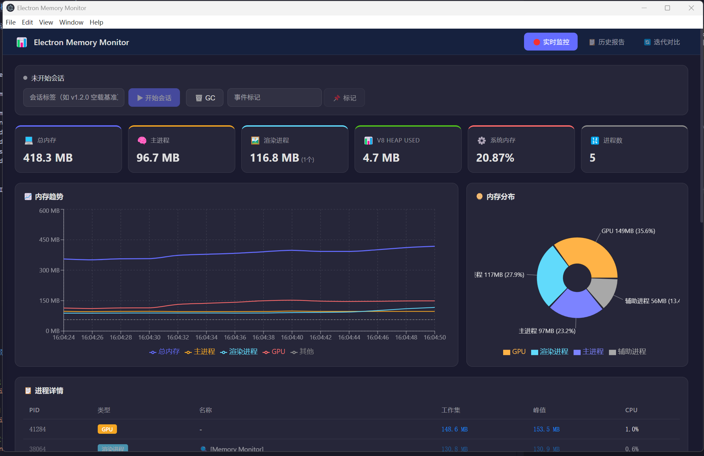
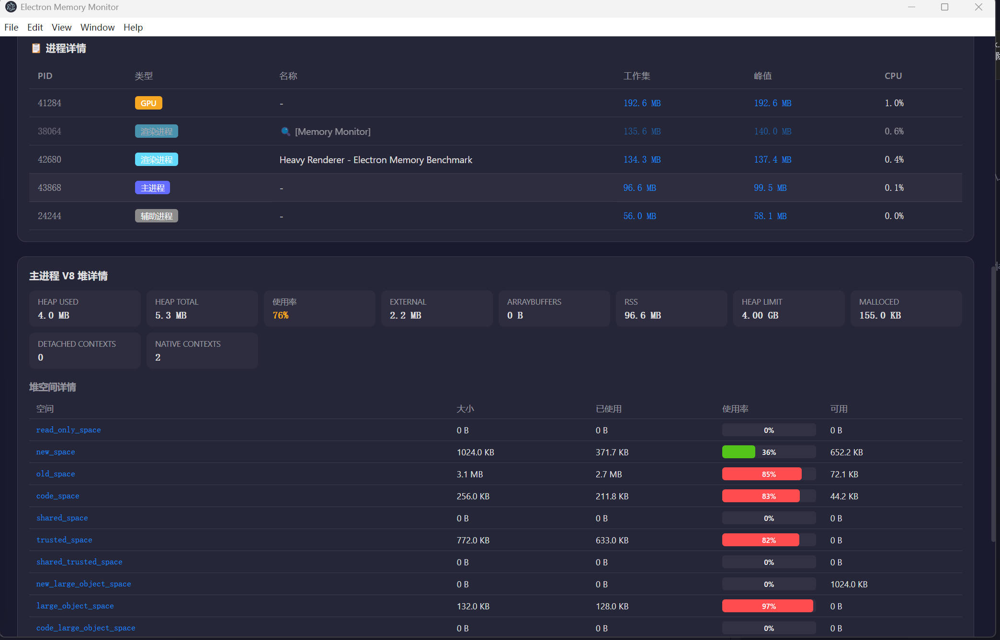
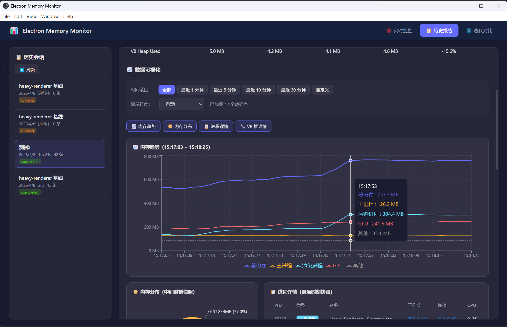
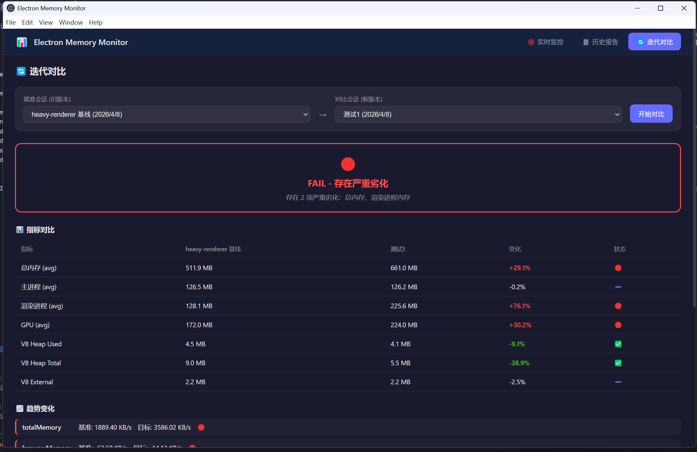
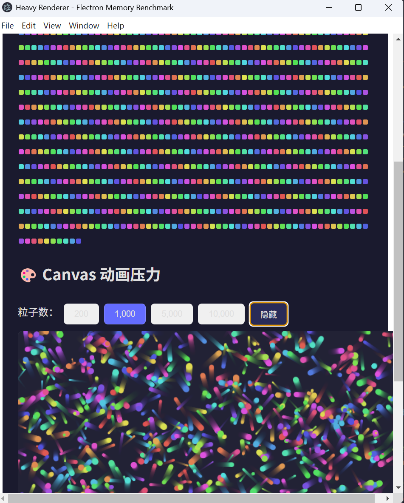

<p align="center">
  <h1 align="center">Electron Memory Monitor</h1>
  <p align="center">
    <strong>Zero-intrusion memory profiling SDK for Electron applications</strong>
  </p>
  <p align="center">
    Measure → Diagnose → Suggest → Verify — A complete memory optimization loop
  </p>
</p>

<p align="center">
  
  
  
  
</p>

---

## ✨ Features

- 🔌 **Zero Intrusion** — One line of code to integrate into any Electron project
- 📊 **Real-time Dashboard** — Process-level memory visualization with trends, pie charts, and V8 heap details
- 🔍 **Anomaly Detection** — Automatic memory leak detection, spike alerts, and trend analysis
- 📝 **Session Reports** — Statistical summaries, linear regression trends, and actionable suggestions
- 🔄 **Iteration Comparison** — Diff two sessions to catch memory regressions
- 📤 **Import/Export** — Share session data across teams with `.emmsession` files
- 🏗️ **CI/CD Ready** — Headless mode for automated memory regression testing
- 🎯 **Benchmark Suite** — 8 built-in test scenarios covering various Electron patterns

## 📸 Screenshots

### Real-time Dashboard

Full process-level memory monitoring with trend charts, distribution pie chart, and metric cards:



### Process Details & V8 Heap Inspection

Detailed per-process memory breakdown and V8 heap space analysis (new_space, old_space, code_space, etc.):



### Session Reports & Historical Data

Historical session list with trend visualization, time range filtering, and data export:



### Iteration Comparison

Compare two sessions to detect regressions — with verdict (PASS/WARN/FAIL), metric diff table, and trend analysis:



### Benchmark Scenarios

Built-in stress test scenarios (DOM pressure, Canvas animation, etc.) for baseline measurement:



---

## 🚀 Quick Start

### Installation

```bash
# Using pnpm (recommended)
pnpm add @electron-memory/monitor

# Using npm
npm install @electron-memory/monitor

# Using yarn
yarn add @electron-memory/monitor
```

### Basic Usage (Level 1: Zero Intrusion)

Add **just one line** to your Electron main process:

```typescript
// your-project/electron/main.ts
import { ElectronMemoryMonitor } from '@electron-memory/monitor'

new ElectronMemoryMonitor()  // That's it! Everything is automatic.

// ---- Your existing code below, no changes needed ----
import { app, BrowserWindow } from 'electron'

app.whenReady().then(() => {
  const win = new BrowserWindow({ /* ... */ })
  win.loadURL('...')
})
```

The SDK will automatically:
1. Wait for `app.whenReady()`
2. Start collecting memory data from all processes
3. Open the monitoring dashboard window
4. Begin anomaly detection

### With Configuration

```typescript
import { ElectronMemoryMonitor } from '@electron-memory/monitor'

const monitor = new ElectronMemoryMonitor({
  enabled: process.env.NODE_ENV !== 'production',  // Disable in production
  collectInterval: 2000,          // Collect every 2 seconds
  openDashboardOnStart: true,     // Auto-open dashboard
  processLabels: {
    'My App': 'Main Window',      // Label processes for clarity
    'Settings': 'Settings Page',
  },
})
```

---

## 📖 Integration Levels

### Level 1: Zero Intrusion (Recommended, covers 90% use cases)

```typescript
import { ElectronMemoryMonitor } from '@electron-memory/monitor'
new ElectronMemoryMonitor()
```

**Capabilities:** All-process memory overview / Main process V8 details / Anomaly detection / Data persistence / Dashboard / Reports

### Level 2: Enhanced (Optional — Renderer V8 details)

```typescript
// main.ts
import { ElectronMemoryMonitor } from '@electron-memory/monitor'
new ElectronMemoryMonitor({ enableRendererDetail: true })

// preload.ts — add one line
import { injectRendererReporter } from '@electron-memory/monitor/preload'
injectRendererReporter()
```

**Additional capabilities:** Per-renderer V8 heap details (heapUsed, heapTotal, external, arrayBuffers)

### Level 3: Deep Integration (Optional — Custom markers & CI/CD)

```typescript
import { ElectronMemoryMonitor } from '@electron-memory/monitor'

const monitor = new ElectronMemoryMonitor()

// Mark important business events on the timeline
monitor.mark('user-opened-settings')
monitor.mark('large-file-loaded', { size: '50MB' })

// Listen for anomalies
monitor.on('anomaly', (event) => {
  console.warn('Memory anomaly:', event.title)
})

// Session control for benchmarking
monitor.startSession('v1.2.0 baseline')

// ... run your test scenario ...

const report = await monitor.stopSession()

// CI/CD: fail on regression
if (report.suggestions.some(s => s.severity === 'critical')) {
  process.exit(1)
}
```

---

## ⚙️ Configuration

```typescript
interface MonitorConfig {
  // === Toggle ===
  enabled: boolean                    // Master switch, default: true
  autoStart: boolean                  // Auto-start on instantiation, default: true
  openDashboardOnStart: boolean       // Auto-open dashboard window, default: true

  // === Collection ===
  collectInterval: number             // Collection interval in ms, default: 2000
  persistInterval: number             // Flush-to-disk interval (# of snapshots), default: 60
  enableRendererDetail: boolean       // Collect renderer V8 details (needs preload), default: false
  enableV8HeapSpaces: boolean         // Collect V8 heap space breakdown, default: true

  // === Anomaly Detection ===
  anomaly: {
    enabled: boolean                  // Enable anomaly detection, default: true
    checkInterval: number             // Detection interval in ms, default: 30000
    rules: AnomalyRule[]              // Custom detection rules (appended to built-in)
  }

  // === Storage ===
  storage: {
    directory: string                 // Data directory, default: userData + '/memory-monitor'
    maxSessions: number               // Max retained sessions, default: 50
    maxSessionDuration: number        // Max session duration in ms, default: 24h
  }

  // === Dashboard ===
  dashboard: {
    width: number                     // Window width, default: 1400
    height: number                    // Window height, default: 900
    alwaysOnTop: boolean              // Keep on top, default: false
  }

  // === Process Labels ===
  processLabels: Record<string, string>  // Map window titles to readable names
}
```

---

## 📚 API Reference

### `ElectronMemoryMonitor`

The main SDK class. Extends `EventEmitter`.

#### Lifecycle

| Method | Returns | Description |
|--------|---------|-------------|
| `start()` | `Promise<void>` | Start monitoring (auto-called if `autoStart: true`) |
| `stop()` | `Promise<void>` | Stop monitoring, end any running session |
| `destroy()` | `Promise<void>` | Destroy the instance, clean up all resources |

#### Session Control

| Method | Returns | Description |
|--------|---------|-------------|
| `startSession(label, description?)` | `string` | Start a new test session, returns sessionId |
| `stopSession()` | `Promise<SessionReport \| null>` | End session, generate report |

#### Dashboard

| Method | Returns | Description |
|--------|---------|-------------|
| `openDashboard()` | `void` | Open the monitoring dashboard window |
| `closeDashboard()` | `void` | Close the dashboard window |

#### Data Access

| Method | Returns | Description |
|--------|---------|-------------|
| `getCurrentSnapshot()` | `MemorySnapshot \| null` | Get the latest memory snapshot |
| `getSessions()` | `Promise<TestSession[]>` | List all historical sessions |
| `getSessionReport(sessionId)` | `Promise<SessionReport \| null>` | Get report for a session |
| `getSessionSnapshots(sessionId, startTime?, endTime?, maxPoints?)` | `Promise<MemorySnapshot[]>` | Get snapshot data with optional time filtering and downsampling |
| `compareSessions(baseId, targetId)` | `Promise<CompareReport \| null>` | Diff two sessions |
| `exportSession(sessionId)` | `Promise<{success, filePath?, error?}>` | Export session to `.emmsession` file |
| `importSession()` | `Promise<{success, session?, error?}>` | Import session from file |
| `deleteSession(sessionId)` | `Promise<boolean>` | Delete a session |

#### Tools

| Method | Returns | Description |
|--------|---------|-------------|
| `triggerGC()` | `Promise<GCResult>` | Manually trigger garbage collection |
| `takeHeapSnapshot(filePath?)` | `Promise<string>` | Export V8 heap snapshot, returns file path |
| `mark(label, metadata?)` | `void` | Add an event marker to the timeline |
| `getConfig()` | `MonitorConfig` | Get current configuration |

#### Events

```typescript
monitor.on('snapshot', (data: MemorySnapshot) => { /* every collection cycle */ })
monitor.on('anomaly', (event: AnomalyEvent) => { /* anomaly detected */ })
monitor.on('session-end', (report: SessionReport) => { /* session completed */ })
```

---

## 🏗️ Architecture

```
ElectronMemoryMonitor (Facade)
│
├── MemoryCollector          — Timer-driven data collection from all Electron APIs
│   ├── app.getAppMetrics()       → All process memory overview
│   ├── process.memoryUsage()     → Main process Node.js memory
│   ├── v8.getHeapStatistics()    → Main process V8 details
│   ├── v8.getHeapSpaceStatistics() → V8 heap spaces
│   └── os.totalmem() / freemem() → System memory
│
├── DataPersister            — JSONL streaming storage with buffered writes
├── SessionManager           — Session lifecycle & index management
├── AnomalyDetector          — Sliding window + rule-based anomaly detection
├── Analyzer                 — Statistical analysis, trends, improvement suggestions
├── DashboardManager         — Self-contained BrowserWindow with pre-built UI
└── IPCBridge                — Auto-registered IPC channels (emm:* prefix)
```

### How Zero Intrusion Works

The key insight: **all Electron memory data is accessible from the main process** — no renderer modification needed.

```
app.getAppMetrics()         → All process memory (no renderer cooperation needed)
process.memoryUsage()       → Main process V8 heap (main process API)
v8.getHeapStatistics()      → Main process V8 details (main process API)
webContents.getOSProcessId() → PID-to-window mapping (main process API)
```

The only feature requiring renderer cooperation is "renderer V8 heap details" (Level 2), which is an **enhancement**, not a core feature.

---

## 🧪 Benchmark Suite

This monorepo includes 8 test scenario apps for establishing memory baselines:

| Scenario | Purpose | What it tests |
|----------|---------|---------------|
| `bare-minimum` | Electron bare startup | Minimum memory footprint of an empty Electron app |
| `single-window` | Single window + blank page | Memory overhead of one blank renderer |
| `multi-window` | Multiple windows (2/5/10/20) | Per-window memory increment & marginal cost |
| `heavy-renderer` | Heavy rendering | DOM pressure, Canvas animation, timers |
| `ipc-stress` | IPC communication | High-frequency IPC memory impact |
| `real-world-sim` | Real business simulation | Routing, lists, modals, WebSocket-like data push |
| `browser-sim` | Browser simulation | WebContentsView open/close page lifecycle |
| `electron-demo` | Demo template | Electron + React + TypeScript baseline |

### Running Scenarios

```bash
# Install dependencies
pnpm install

# Build the SDK first
pnpm build:sdk

# Run individual scenarios
pnpm dev:bare-minimum
pnpm dev:single-window
pnpm dev:multi-window        # default 5 windows
pnpm dev:multi-window:10     # 10 windows
pnpm dev:heavy-renderer
pnpm dev:ipc-stress
pnpm dev:real-world
pnpm dev:browser-sim
pnpm dev:demo

# Run all benchmarks automatically
npx tsx scripts/run-benchmark.ts

# Run a specific scenario with custom duration
npx tsx scripts/run-benchmark.ts --scenario bare-minimum --duration 60
```

---

## 📊 Reports & Comparison

### Session Report

Each completed session generates a `SessionReport` containing:

- **Environment** — Electron/Chrome/Node versions, CPU, system memory
- **Statistical Summary** — min/max/avg/p50/p95/p99 for all metrics
- **Per-process Breakdown** — Browser, Renderer(s), GPU, Utility
- **V8 Heap Analysis** — heapUsed, heapTotal, external, arrayBuffers
- **Trend Analysis** — Linear regression (slope, R², direction, confidence)
- **Anomaly Events** — Detected issues during the session
- **Improvement Suggestions** — Actionable recommendations

### Built-in Suggestion Rules

The analyzer includes 7 built-in detection rules:

| Rule | Detects | Severity |
|------|---------|----------|
| Detached Contexts | Unreleased BrowserWindow/WebContents | Critical |
| Main Process Leak | Continuous main process memory growth | Warning |
| Renderer Memory High | Single renderer > 300MB | Warning |
| Old Space Dominant | old_space > 85% of heap | Info |
| ArrayBuffer High | ArrayBuffer > 50MB average | Info |
| GC Ineffective | Heap usage consistently > 80% | Warning |
| Too Many Processes | Process count > 10 | Warning |

### Iteration Comparison

Compare two sessions to detect regressions:

```typescript
const compare = await monitor.compareSessions(baseSessionId, targetSessionId)

console.log(compare.verdict)       // 'pass' | 'warn' | 'fail'
console.log(compare.regressions)   // Degraded metrics
console.log(compare.improvements)  // Improved metrics
```

**Default regression thresholds:**

| Metric | Warn | Fail |
|--------|------|------|
| Total Memory | > +5% | > +15% |
| Main Process | > +10% | > +25% |
| V8 Heap Used | > +10% | > +30% |

---

## 🔧 CI/CD Integration

```typescript
import { ElectronMemoryMonitor } from '@electron-memory/monitor'

async function runMemoryCI() {
  const monitor = new ElectronMemoryMonitor({
    openDashboardOnStart: false,  // No UI in CI
    storage: { directory: './reports' },
  })

  const sessionId = monitor.startSession(`CI-build-${process.env.BUILD_NUMBER}`)

  // Run for 5 minutes
  await new Promise(resolve => setTimeout(resolve, 5 * 60 * 1000))
  const report = await monitor.stopSession()

  // Compare with last run
  const sessions = await monitor.getSessions()
  if (sessions.length >= 2) {
    const prev = sessions[sessions.length - 2]
    const compare = await monitor.compareSessions(prev.id, sessionId)

    if (compare.verdict === 'fail') {
      console.error('❌ Memory regression detected!')
      console.error('Regressions:', compare.regressions)
      process.exit(1)
    }
  }

  console.log('✅ Memory benchmark passed')
  process.exit(0)
}
```

---

## 📁 Project Structure

```
electron-memory-monitor/
│
├── packages/
│   └── electron-memory-monitor/          # SDK: @electron-memory/monitor
│       ├── src/
│       │   ├── index.ts                  # SDK entry point
│       │   ├── core/
│       │   │   ├── monitor.ts            # Main facade class
│       │   │   ├── collector.ts          # Memory data collector
│       │   │   ├── persister.ts          # JSONL data persistence
│       │   │   ├── session.ts            # Session lifecycle manager
│       │   │   ├── anomaly.ts            # Anomaly detection engine
│       │   │   ├── analyzer.ts           # Report analysis & suggestions
│       │   │   └── dashboard.ts          # Dashboard window manager
│       │   ├── ipc/
│       │   │   ├── channels.ts           # IPC channel constants
│       │   │   ├── main-handler.ts       # Main process IPC handlers
│       │   │   └── preload-api.ts        # Preload bridge
│       │   ├── ui/                       # Dashboard UI (React + Recharts)
│       │   │   ├── pages/
│       │   │   │   ├── Dashboard.tsx     # Real-time monitoring
│       │   │   │   ├── Report.tsx        # Historical reports
│       │   │   │   └── Compare.tsx       # Session comparison
│       │   │   ├── components/           # Reusable UI components
│       │   │   └── hooks/                # React hooks
│       │   ├── preload/
│       │   │   └── inject.ts             # Optional renderer reporter
│       │   └── types/                    # TypeScript type definitions
│       ├── tsup.config.ts                # Build config (CJS + ESM)
│       └── package.json
│
├── apps/                                 # Benchmark scenario apps
│   ├── bare-minimum/                     # Scenario 1: Bare Electron
│   ├── single-window/                    # Scenario 2: Single window
│   ├── multi-window/                     # Scenario 3: Multi window
│   ├── heavy-renderer/                   # Scenario 4: Heavy rendering
│   ├── ipc-stress/                       # Scenario 5: IPC stress
│   ├── real-world-sim/                   # Scenario 6: Real-world simulation
│   ├── browser-sim/                      # Scenario 7: Browser simulation
│   └── electron-demo/                    # Demo template
│
├── scripts/
│   └── run-benchmark.ts                  # Batch benchmark runner
│
├── reports/                              # Generated reports directory
├── images/                               # Screenshots
└── MEMORY_PROFILING_DESIGN.md            # Detailed design document
```

---

## 🛠️ Tech Stack

| Component | Technology | Why |
|-----------|-----------|-----|
| Monorepo | pnpm workspace | Fast, disk-efficient, native workspace support |
| SDK Build | tsup (esbuild) | Fast builds, CJS + ESM dual output |
| UI Build | Vite | Pre-built and bundled into SDK |
| Charts | Recharts | React ecosystem, lightweight, clean API |
| Data Storage | JSONL files | No external deps, append-only, streamable |
| Styling | Less | Consistent with existing project setup |
| Statistics | Built-in | Linear regression, percentiles — too simple for external libs |

---

## 📄 Data Privacy

- All data is stored **locally** in `app.getPath('userData')`
- **No data is sent to external servers**
- Reports contain no source code
- Heap snapshots may contain sensitive runtime data — share with caution

---

## 🤝 Contributing

Contributions are welcome! Please feel free to submit a Pull Request.

1. Fork the repository
2. Create your feature branch (`git checkout -b feature/amazing-feature`)
3. Commit your changes (`git commit -m 'Add some amazing feature'`)
4. Push to the branch (`git push origin feature/amazing-feature`)
5. Open a Pull Request

---

## 📜 License

This project is licensed under the MIT License — see the [LICENSE](LICENSE) file for details.
